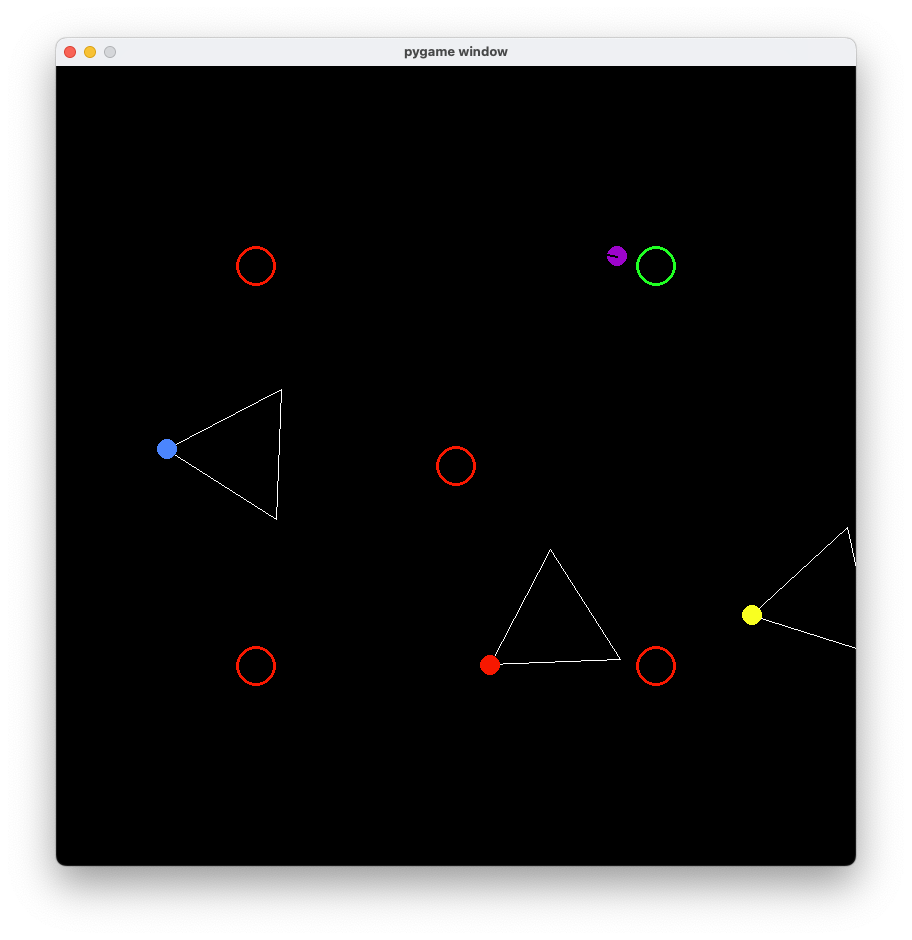

# 🎮 CatchMeIfYouCan

## 📝 Project Overview
This is a simple guard-chase game featuring **three enemy guards** (🔴 Red, 🔷 Blue, 🔶 Yellow) patrolling around **five important goal locations**. The player's objective is to touch all five goal locations to win the game.

### 🏆 Game Win/Loss Conditions:
- ✅ **Player Wins**: 
  - The player touches all five goal locations.
  - All guards go off the screen.
- ❌ **AI Wins**: 
  - A guard catches the player.
  - The player moves off the screen.

---

## 🤖 AI Method: `ai(percept, goals, comms)`

Each guard runs its own version of the AI method with the following parameters:

### **Parameters:**
- **`percept`** – Tuple that tells the guard if it sees the player.
  - `(False, None)` if the player is not visible.
  - `(True, (dx, dy), distance)` if visible:
    - `dx, dy`: Directional unit vector toward the player.
    - `distance`: Distance from the guard to the player.

- **`goals`** – A list of actual goal location objects. Each has `x` and `y` positions and status info.

- **`comms`** – A shared dictionary used for communication between guards.
  - Keys: `"R"`, `"B"`, and `"Y"` for Red, Blue, and Yellow guards.

### **Return Value:**
Each AI method returns a tuple:
```python
(turn_value, move_value, message)
```

- `turn_value` ∈ `[-1, 1]`: 
  - Positive: turn clockwise.
  - Negative: turn counter-clockwise.
  - 0: keep facing the same direction.

- `move_value` ∈ `[-1, 1]`: 
  - Positive: move forward.
  - Negative: move backward.
  - 0: stay still.

- `message`: 
  - `None` or a tuple like `("Found you!", 1000)` to display above the guard.

---

## 🧠 My Implementation

I focused on building simple and distinct behaviors for each guard without using complex math functions. Each guard acts independently with some shared logic.

### 🔶 Enemy Yellow (Simple Patrol)
- Patrols back and forth.
- Switches direction every **100 ticks**.
- Easy to implement using a counter without using sine/cosine logic.

### 🔷 Enemy Blue (Desynced Patrol)
- Also patrols back and forth.
- Changes direction every **85 ticks**.
- Using a different timer value avoids synchronization and adds unpredictability.

### 🔴 Enemy Red (Waypoint Patrol)
- Patrols using a list of waypoints at the corners of the map.
- Moves step-by-step toward the next waypoint based on X/Y positions.

### 🕹 Controls & Behavior:
- Each guard uses a `self.timer` to decide when to switch directions.
- Timers increment each frame and reset upon switching.
- Movement is handled using fixed `turn = direction * 0.5` and `move = 0.5`.
- The Red guard uses a list `self.ways` of waypoint coordinates to move between corners.

---

## 👁️ Player Detection & Communication

When a guard sees the player (via `percept`), it:
- Switches to **chase mode**.
- Moves in the direction of the player.
- Sends messages using `comms["Y"]`, for example, to alert the others.
- Can optionally display a visual alert using the return message.

---

## 📏 Distance Calculation Logic

To control movement toward goals or the player, I used simple **Manhattan distance**:

```python
distance = abs(u.pos.x - c.pos.x) + abs(u.pos.y - c.pos.y)
```

- This tells how many grid steps (horizontal + vertical) a unit must move to reach a target.
- It’s used to:
  - Select the **closest defender** to protect cities.
  - Move **attackers** toward the nearest enemy or goal.

To calculate direction:
```python
dx = target.x - unit.x
dy = target.y - unit.y
```
- The AI then moves either horizontally or vertically toward the target based on which difference (`dx` or `dy`) is greater.

---

## 🔄 Fallback Movement Strategy

If no enemy unit is visible, the guard falls back to target the **nearest enemy city** using a simplified loop:
```python
nearest_city = None
min_distance = very large number

for city in enemy_cities:
    dist = abs(city.x - unit.x) + abs(city.y - unit.y)
    if dist < min_distance:
        min_distance = dist
        nearest_city = city
```

This guarantees movement continues even if the player is temporarily hidden.

---

## 🧪 How I Tested

To ensure proper functionality, I ran the game under various scenarios and added `print()` statements to debug movement and AI states.

- ✅ Verified unit building, patrol logic, and timers.
- ✅ Ensured each guard had a distinct movement style.
- ✅ Confirmed message sending and visual alerts during chases.
- ✅ Tested guard behavior when approaching screen boundaries.
- ✅ Checked that AI behavior switches based on player visibility.
- ✅ Watched for correct game endings when win/loss conditions were triggered.

These tests gave confidence that the AI behaved as expected and responded dynamically to the game state.


---

## ✅ Conclusion

This project helped me learn how to:
- Use simple AI logic for patrol and chase behaviors.
- Coordinate agents using shared communication.
- Handle edge cases like screen boundaries.
- Use timers and simple logic to create unpredictable, non-synchronized guard movement.

While there is room for future improvement (e.g., smarter pathfinding), this version successfully meets the assignment goals using beginner-friendly logic and clear AI transitions.

---

